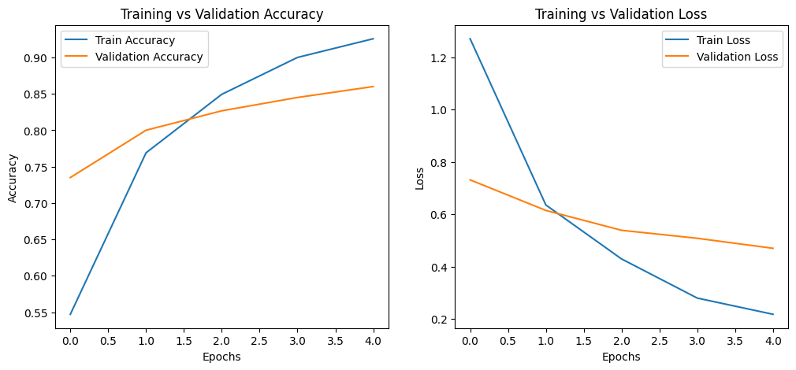
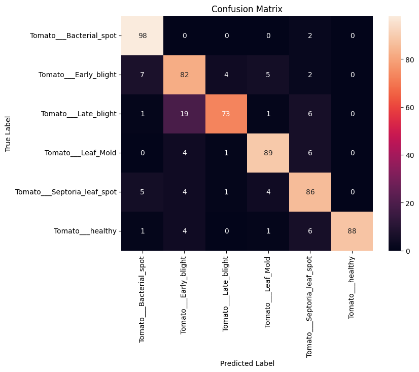
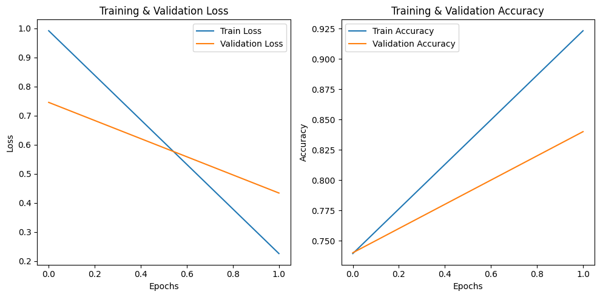
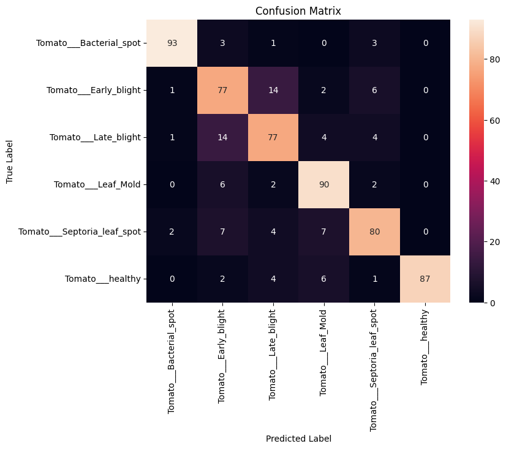

# 🍅 Tomato Disease Detection using CNN

This deep learning project classifies tomato leaf images into six categories of diseases using a Convolutional Neural Network (CNN).

## 🔍 Dataset
https://www.kaggle.com/datasets/kaustubhb999/tomatoleaf
- **Classes**:  
  - Tomato___Bacterial_spot  
  - Tomato___Early_blight  
  - Tomato___Late_blight  
  - Tomato___Leaf_Mold  
  - Tomato___Septoria_leaf_spot  
  - Tomato___healthy

- **Training images**: 6,000  
- **Test images**: 600

---

## 🧠 Model: Convolutional Neural Network (CNN)

- **Final Training Accuracy**: 92.57%  
- **Final Validation Accuracy**: 86.00%  
- **Final Training Loss**: 0.2173  
- **Final Validation Loss**: 0.4696

---

## 📈 Performance

### Accuracy and Loss

### Confusion Matrix

### Classification Report

precision    recall  f1-score   support

Tomato___Bacterial_spot   0.88   0.98   0.92   100  
Tomato___Early_blight     0.73   0.82   0.77   100  
Tomato___Late_blight      0.92   0.73   0.82   100  
Tomato___Leaf_Mold        0.89   0.89   0.89   100  
Tomato___Septoria_leaf    0.80   0.86   0.83   100  
Tomato___healthy          1.00   0.88   0.94   100  

Overall Accuracy: 86.00%

## 🧠 Model: VGG16

- **Final Training Accuracy**: 92.33%  
- **Final Validation Accuracy**: 84.00%  
- **Final Training Loss**: 0.2256  
- **Final Validation Loss**: 0.4337

---

## 📈 Performance

### Accuracy and Loss

### Confusion Matrix

### Classification Report

precision    recall  f1-score   support

Tomato___Bacterial_spot   0.96   0.93   0.94   100  
Tomato___Early_blight     0.71   0.77   0.74   100  
Tomato___Late_blight      0.75   0.77   0.76   100  
Tomato___Leaf_Mold        0.83   0.90   0.86   100  
Tomato___Septoria_leaf    0.83   0.80   0.82   100  
Tomato___healthy          1.00   0.87   0.93   100  

Overall Accuracy: 84.00%
